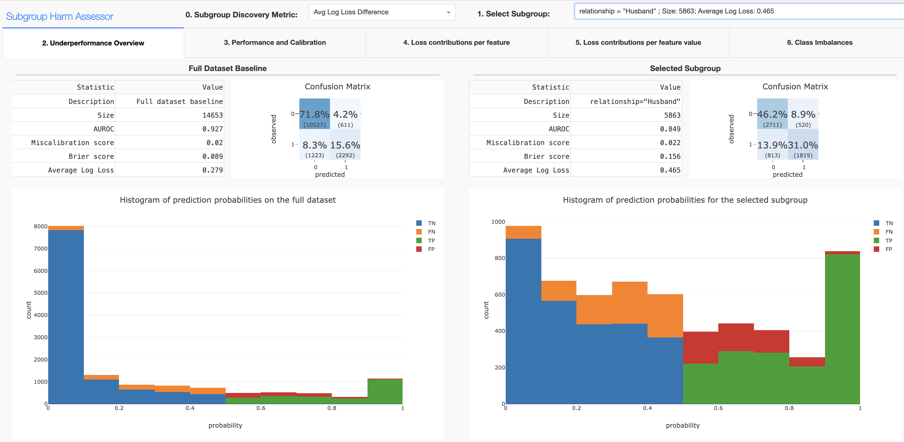

# Subgroup Harm Assessor tool

## Description
This project aims to assess the fairness of machine learning models in terms of subgroup predictive bias. It provides tools and metrics to evaluate the performance of models across different subgroups and identify potential biases based on model loss explanations.

## Requirements
To run the project, you need to have Python 3.7 or higher installed (3.8 recommended). You can install the required packages using the following command:
```bash
pip install -r requirements.txt
```

## Run
To run the project, you can use the following command:
```bash
python app.py
```

To see all available configuration options, you can use the CLI:
```bash
python app.py --help
```

## Usage
The project provides a web interface to interact with the model. You can access it by opening the browser and navigating to `http://127.0.0.1:8050/` (or the address specified in the console). Step 0 is optional as the thesis argues for the average log loss difference to be used as a default quality metric for the subgroup harm assessment of risk scoring systems. 



With the 6 step process, we implement the Subgroup Harm and Predictive Bias assessment framework discussed in the thesis project. The steps are as follows:
1. **Select Subgroup**: Choose the subgroup to analyze. The subgroup is defined by a (set of) discriminators based on specific feature values or ranges and ordered in terms of magnificance of the quality metric selected.
2. **Analyzing profile of underperformance**: We analyze the discriminatory and calibration abilities of the model. The subgroup is compared to the overall population and we can analyse the distribution of predicted probabilities.
3. **Analysing performance and calibration**: The next step is to analyze the performance and calibration of the model in detail, to see if we can identify any potential predictive bias or we should consider calibration per group (for the feature of the subgroup selected).
4. **Model Loss Feature importance**: We can analyze the feature importance of the model to see if certain features are less informative for the model.
5. **Feature value model loss contributions**: We can analyze the feature value contributions to the model loss to see if certain feature values are less informative for the model.
6. **Class imbalances**: We can analyze the class imbalances in the subgroup to see if the model is biased towards the majority class (indicating representation or aggregation bias).

### Experiments 
To show the utility of the tool for the goal of identifying features that are less informative, we can run experiments on a random subgroup which follows the distribution of the total population. We can load an overview with the random subgroup with the following command:
```bash
python app.py --random_subgroup
```
or simply:
```bash
python app.py -r
```

Additionally, if we want to add artificial bias, we can use the following command:
```bash
python app.py --bias [bias_type]
```
where `[bias_type]` can be one of the following:
```
swap: Swap the feature values of a certain categorical feature of the subgroup
random: Add random noise to the feature values of a certain continuous feature of the subgroup
mean: Swap the continuous feature values of the subgroup with the mean of the total population
```
And others, which can be found in the `load.py` file.

## Loading own dataset
To load your own dataset, please edit the `import_dataset` function in load.py, retaining the same function signature (returning X and y_true).

## Known issues:
Currently, there are some non-critical issues with the project:
- When switching tabs, the height of the plots can switch to the default 500px. It can be fixed by reselecting the subgroup (which regenerates the plots).
